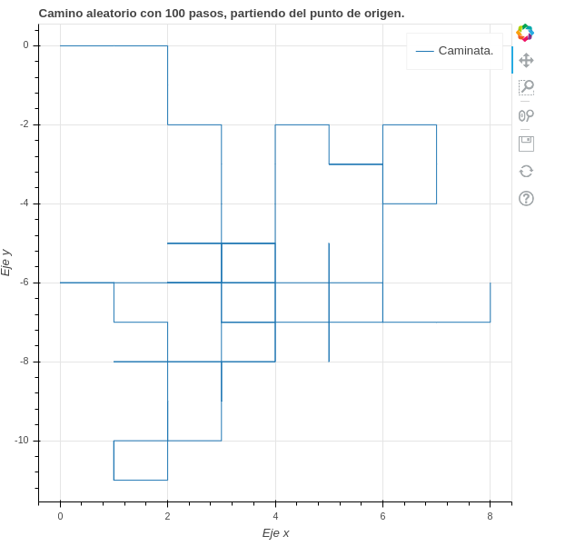

# Camino de Borrachos.

### Descripción.

Ejercicio del curso "Programación dinámica y estocástica con Python" de [Platzi](http://platzi.com).

Implementa el problema conocido como [*Camino del borracho* o *Camino aleatorio*](https://es.wikipedia.org/wiki/Camino_aleatorio).

En un eje de coordenadas, imaginemos que posicionamos una persona, y le pedimos que haga una caminata de _N_ pasos por el eje de manera aleatoria, es decir que en cada paso tenga la misma posibilidad de elegir para que lado caminar (arriba, abajo, izquierda o derecha).

### Ejecución.

* Crear un Entorno virtual: `python3 -m venv env`
* Activamos el entorno: `source env/bin/activate`
* Instalar las librerias requeridas: `pip install -r requirements.txt`
* Para ejecutar correr en una terminal: `python camino_aleatorio.py`
